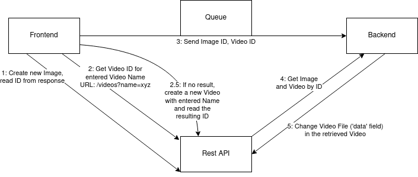

# ASE-AwesomeTimelapse
Small project using CI and CD Workflow

## REST API
### Docker Setup
Run `docker-compose up --build -d`.

Get the IP of that server: `docker inspect -f '{{range .NetworkSettings.Networks}}{{.IPAddress}}{{end}}' django`

Test by executing `test_sender.py` within the backend container:

`test_sender.py 1-1` to add image with ID 1 to video with ID 1

## Communication

